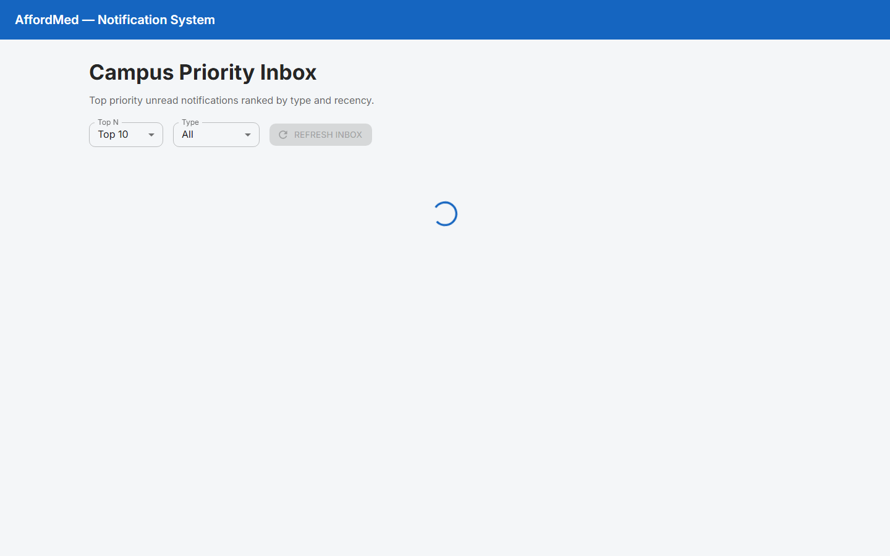
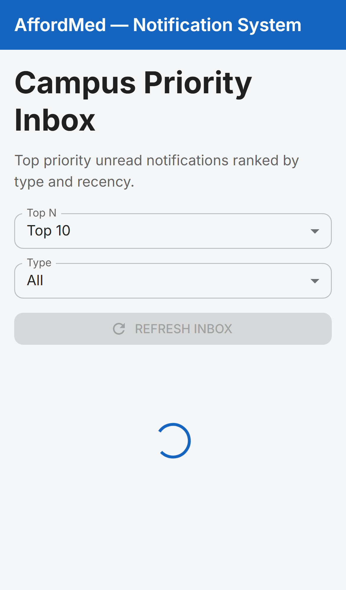

# Notification App — Frontend

React + TypeScript + Material UI implementation of the Campus Priority Inbox.

## Stack

- **React 19** with **TypeScript**
- **Material UI** for styling
- **Vite** for development and build
- Custom **Min Heap** for Top N priority ranking (same logic as backend)

## Features

- Priority Inbox displaying Top N notifications (10 / 15 / 20)
- Filter by notification type (Placement, Result, Event)
- Responsive layout for desktop and mobile
- Remote logging via Test Server Log API (`stack: frontend`)
- Fetches from protected notifications API with bearer token

## Setup

```bash
cd notification_app_fe
npm install
cp .env.example .env
```

Set your token in `.env`:

```env
VITE_API_AUTHORIZATION=Bearer <your-token>
```

Use **your own** assessment credentials only.

## Run

```bash
npm run dev
```

Open `http://localhost:5173`

API requests are proxied through Vite to avoid CORS issues:

```text
/evaluation-service → http://4.224.186.213/evaluation-service
```

## Build

```bash
npm run build
npm run preview
```

## Screenshots

| View | Preview |
| ---- | ------- |
| Desktop |  |
| Mobile |  |

See [`screenshots/README.md`](screenshots/README.md) for capture instructions.

## Folder Structure

```text
notification_app_fe/
├── src/
│   ├── components/
│   ├── config/
│   ├── heap/
│   ├── services/
│   ├── types/
│   ├── utils/
│   ├── App.tsx
│   └── main.tsx
├── screenshots/
├── package.json
└── vite.config.ts
```
